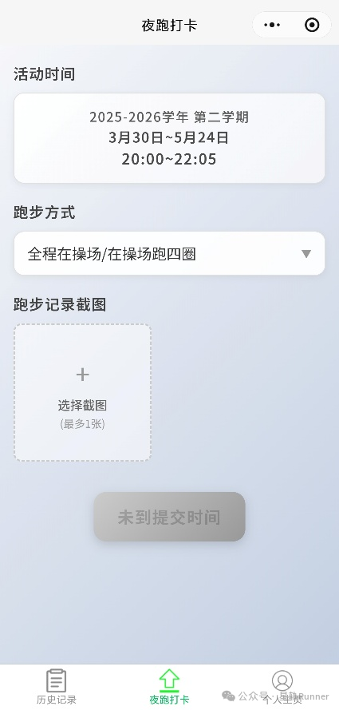
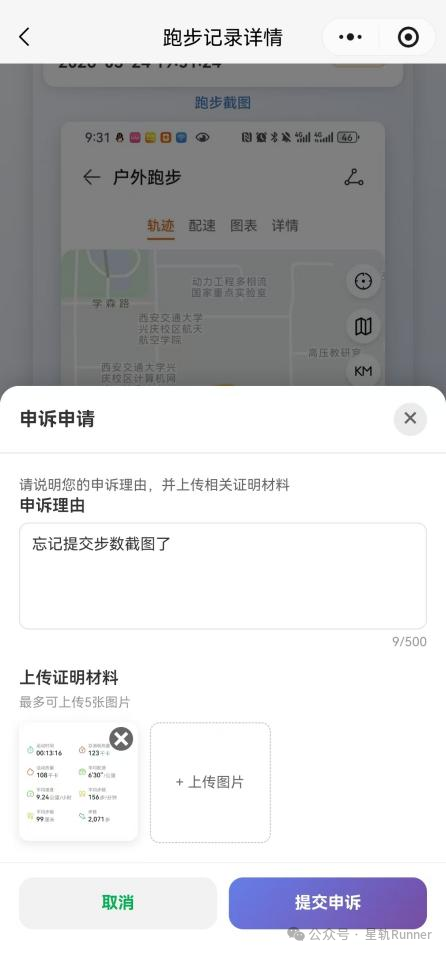

# 星轨Runner - 校园夜跑管理系统（小程序端）

## 项目概述

星轨Runner是一款基于微信小程序开发，面向西安交通大学“星荧夜跑”活动的校园夜跑管理系统，集成了夜跑打卡、历史记录查询、审核进度同步、所获奖项计算、在线申诉等一站式功能，让同学们更便捷地参与活动，也让审核过程更高效。

## 技术架构

### 前端技术栈
- **框架**: 微信小程序原生框架
- **UI组件**: 微信小程序原生组件
- **样式**: WXSS (微信样式语言)
- **数据绑定**: WXML + JavaScript
- **状态管理**: 小程序全局数据 + 本地存储

### 后端技术栈
- **云开发平台**: 腾讯云云开发 (CloudBase)
- **数据库**: 云开发数据库 (NoSQL)
- **云函数**: Node.js 运行环境
- **文件存储**: 云存储服务

### 开发工具
- **开发工具**: 微信开发者工具
- **版本控制**: Git
- **包管理**: npm

## 功能简介

用户认证：实现微信授权登录和自动注册，支持用户信息本地缓存和登录状态验证

跑步打卡：提供两种打卡方式，操场跑步需位置验证，任意场地跑步需步数截图

记录管理：管理跑步历史记录，支持状态分类、时间筛选、下拉刷新和详细记录查看

申诉处理：用户可对未通过记录提出申诉，包含提交、审核、结果通知和申诉历史查看

个人中心：提供个人信息展示、奖项查看、申诉历史管理和信息修改功能

## 项目结构

```
mini_program/
├── cloudfunctions/          # 云函数目录
│   ├── login-user/          # 用户登录
│   ├── submitRunningRecord/ # 提交跑步记录
│   ├── getCurrentActivity/  # 获取活动信息
│   ├── submitAppeal/        # 提交申诉
│   ├── auditAppeal/         # 审核申诉
│   ├── manageActivityConfig/# 活动配置管理
│   └── ...
├── miniprogram/             # 小程序源码
│   ├── images/              # 静态资源
│   ├── pages/               # 页面文件
│   │   ├── launch/          # 启动页
│   │   ├── login/           # 登录页
│   │   ├── home/            # 个人主页
│   │   ├── submit/          # 夜跑打卡
│   │   ├── record/          # 历史记录
│   │   ├── record-detail/   # 记录详情
│   │   ├── awards/          # 我的奖项
│   │   ├── appeal-history/  # 申诉历史
│   │   └── finish-info/     # 完善信息
│   ├── app.js               # 小程序入口
│   ├── app.json             # 小程序配置
│   ├── app.wxss             # 全局样式
│   └── envList.js           # 环境配置
├── project.config.json      # 项目配置
├── package.json             # 依赖管理
└── uploadCloudFunction.sh   # 云函数部署脚本
```

## 界面展示






## 版本更新记录

### 2026.4.9 v3.0.0

小程序发布并正式用于“星荧夜跑”活动，包含用户认证、跑步打卡、记录管理、申诉处理和个人中心功能等基本功能。

### 2026.4.14 v3.1.0

1.个人主页新增“修改信息”栏，如果有个人信息填写错误，可以点击此处进行修改。

2.增加学号重复提示：若所填学号已存在，系统提示“学号已被注册”，无法修改；若发现本人学号已被注册，请及时联系管理员处理。